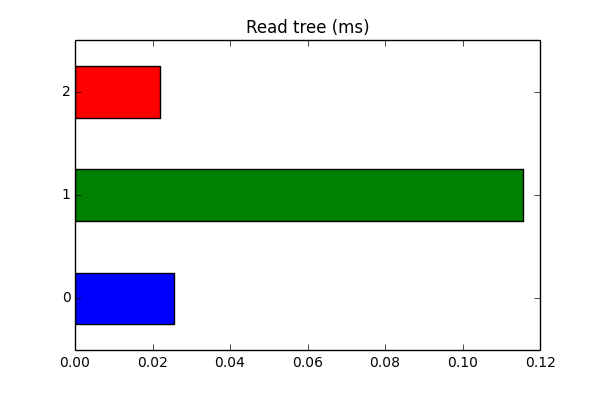
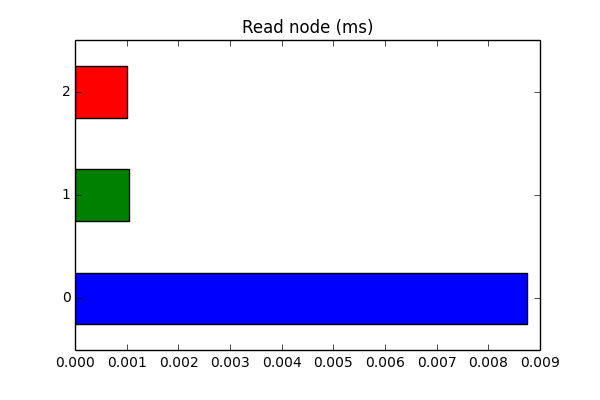
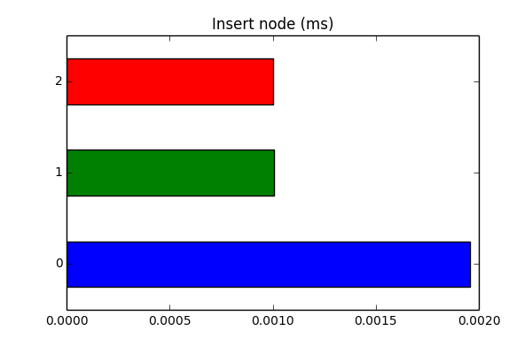
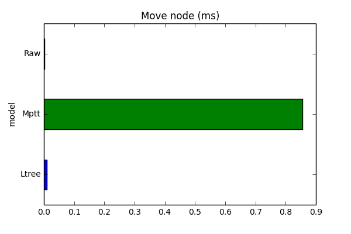

# sql-tree-perfomance
Приложение для тестирования производительности обработки древовидных структур с 
помощью PostgreSQL и Django.

### Задача

Сравинить производительность храниния древовидной структуры данных в PostgreSQL приминительно к 
Django приложению.

### Модели для тестирования

Для работы с рекурсивными структурами в Postgres могут использоваться следующие модели:

1. Adjacency model (AM) - модель, когда в колонке хранится родитель
2. Nested Sets (NS) - модель, когда в колонке хранится полный путь до элемента 
3. Materialised Path model (MP) - модель, когда в паре колонок хранится диапазон всех вложенных элементов

Для их реализации в Django выбраны следующе инструменты:

1. AC - штатная рекурсия Django на основе ForeignKey
2. NS - модуль [django-mptt](https://github.com/django-mptt/django-mptt)
3. MP - модуль ltree PostgreSQL с оберткой [Ltree](https://github.com/yyjinlong/ltreefield)

### Методика тестирования

Тестирование будет проводится на наборе данных из 150 тыс компаний. Время будет замеряться для 
следующих запросов:

1. Чтение всего дерева
2. Чтение произвольного узла
3. Вставка узла
4. Перемещение поддерева между уровнями

Время выполнения запроса будет считаться среднее время выполнения 1000 запросов, с произвольным 
доступом к узлам.

### Аппаратное обеспечение тестового стенда
* CPU  Core i5 2,5 GHz
* RAM 1600 MHz DDR3
* SSD Samsung 850 EVO 500GB 

### Программное обеспечение тестового стенда

* Python 2.7
* Postgres 9.6
* Django 1.8
* psycopg2
* Pandas
* Matplotlib

### Описание приложения для замеров

Для тестирования создано отдельное Django приложение (из данного репозитория). В котором создано по 
одной моделе на каждую схему хранения описанные выше. В приложение добавлены 2 дополнительные команды:

* ```load_tree``` - загружает данные для теста
* ```analize``` - выполняет анализ согласно описанной выше методике

Команды для запуска приложения:
```
python manage.py migrate
python manage.py load_tree <путь до файла с данными>
python manage.py load_tree analize <кол-во запросов для анализа>
```

Результаты команды ```analize``` хранятся в папке *report*.

### Результаты

Для простоты анализа, я приведу графики с полученными значениями без анализа причин результатов,
т. к. для других данных они могут быть другими.

##### Чтение всего дерева



##### Чтение произвольного узла



##### Вставка узла



##### Перемещение поддерева между уровнями



### Итоги

Как можно заметить, модель АМ показал средние значения во всех тестах, что делает ее достаточно 
универсальной для применения к различным задачам. Модель NS наобор показала не удовлетворительный
результат, так как в большенстве тестов показала последний результат.

Так же надо отметить, что результаты могут разнится для других наборов данных и поэтому перед 
принятием решения рекомендуется провести аналогичный тест для своих данных.
